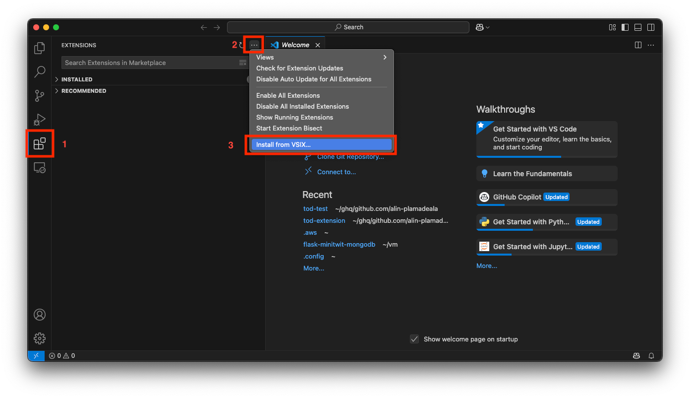

# How to install the Extension

1. Download the `.vsix` file from the releases section: https://github.com/alin-plamadeala/tod/releases

2. Open Visual Studio Code and go to the Extensions view by clicking on the Extensions icon in the Activity Bar on the
   side of the window or by pressing `Cmd+Shift+X` (on macOS) or `Ctrl+Shift+X` (on Windows/Linux).

3. Click on the three-dot menu in the top-right corner of the Extensions view and select "Install from VSIX..." and
   select the downloaded `.vsix` file.

4. A new icon should now appear in the Activity Bar on the side of the window.

