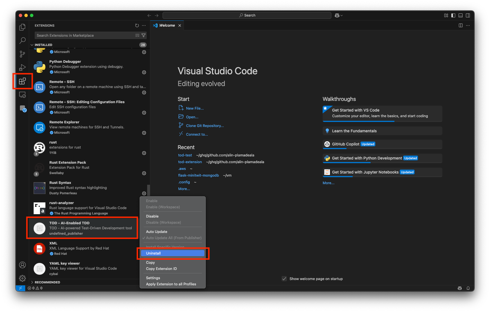

# How to uninstall the extension

1. Open Visual Studio Code and go to the Extensions view by clicking on the Extensions icon in the Activity Bar on the
   side of the window or by pressing `Cmd+Shift+X` (on macOS) or `Ctrl+Shift+X` (on Windows/Linux).

2. In the Extensions view, search for the extension in the "Installed" section or use the search bar to find it.

3. Once you find the extension, click on the gear icon (⚙️) next to the extension name.

4. From the dropdown menu, select "Uninstall".
